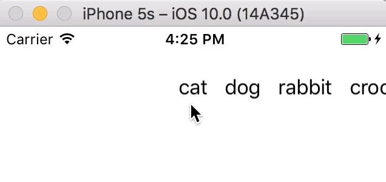
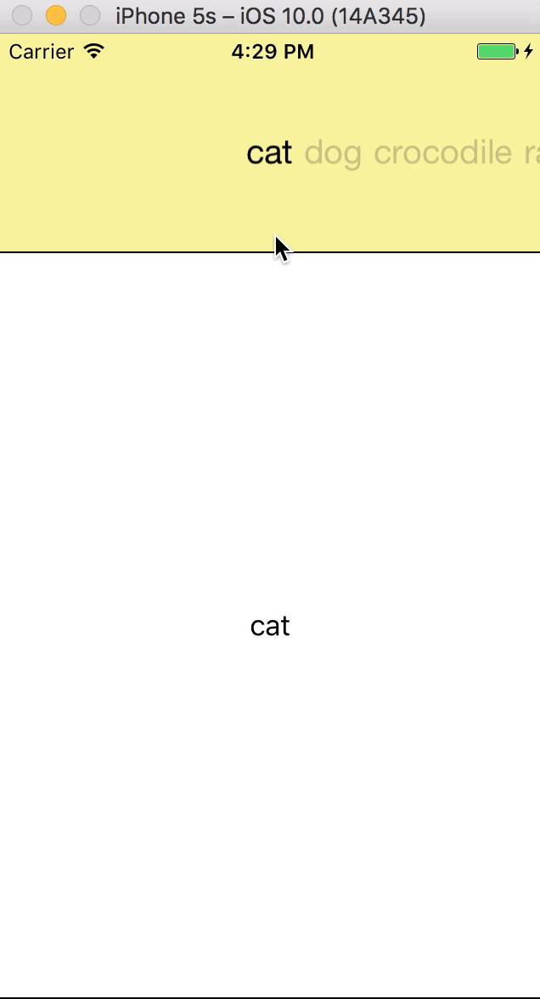
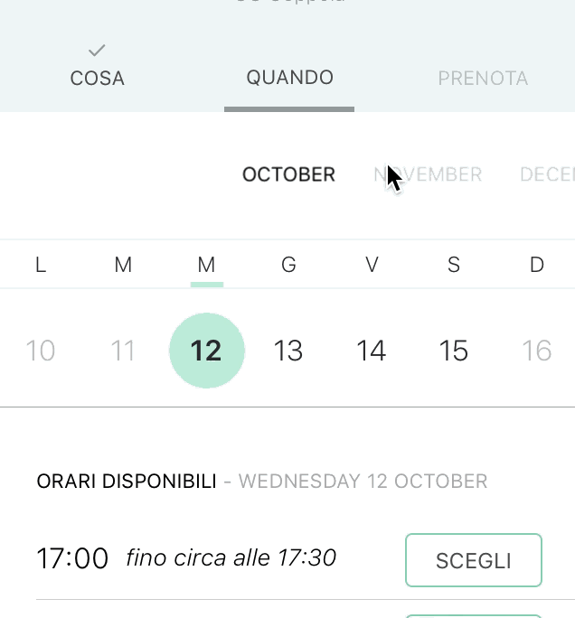

Purpose
--------------

TabbyView is a class designed to simplify the implementation of horizontal, paged scrolling views, also with a different width, like horizontal menu for instance


Installation
-----------------------------
Include TabbyView.swift in your project


Usage example
-----------------------------

```swift
import UIKit

class ViewController: UIViewController, TabbyViewDataSource {

  let titles = ["cat", "dog", "rabbit", "crocodile"]

  let tabbyHeight = CGFloat(100.0)

  override func viewDidLoad() {

    super.viewDidLoad()

    let tabby = TabbyView(frame:CGRect(x:0, y:0, width:view.frame.size.width, height:tabbyHeight))

    tabby.dataSource = self

    view.addSubview(tabby)

  }

  func tabbyViewDataSourceGetViewByPosition(position:Int) -> UIView {

    let titleView = _buildMenuItem(title: titles[position], padding: 7.0)

    return titleView

  }

  func tabbyViewDataSourceGetNumberOfItems(tabbyView: TabbyView) -> Int {

    return titles.count

  }

  func _buildMenuItem(title:String, padding: CGFloat) -> UIView {

    let label = UILabel()
    label.text = title
    label.sizeToFit()

    let titleView = UIView(frame: CGRect(x: 0, y: 0, width: label.frame.width + padding * 2.0, height: tabbyHeight))

    label.frame.origin.x = padding
    label.frame.origin.y = (tabbyHeight - label.frame.height) / 2.0

    titleView.addSubview(label)

    return titleView

  }

}
```


See ExampleViewController.swift for more :



On the road :


TabbyViewDataSource protocol
------------------

Asks your data source for the view that corresponds to the specified position :

```swift
func tabbyViewDataSourceGetViewByPosition(position:Int) -> UIView
```
Asks your data source object for the number of items :

```swift
func tabbyViewDataSourceGetNumberOfItems(tabbyView: TabbyView) -> Int
```

TabbyViewDelegate Delegate
-------------------

Tells the delegate when the user scrolls tabby :

```swift
func tabbyViewDidScroll(tabbyBiew: TabbyView)
```

TabbyItemViewProtocol protocol
-------------------

A view returned by tabbyViewDataSourceGetViewByPosition should implement this protocol :

```swift
protocol TabbyItemViewProtocol {
  func highlight()
  func unhighlight()        
}
```
See ExampleViewController.swift for more
